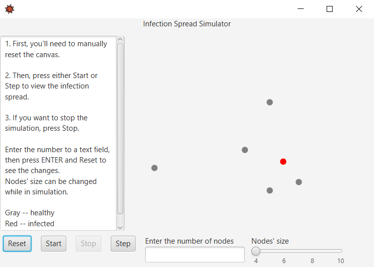
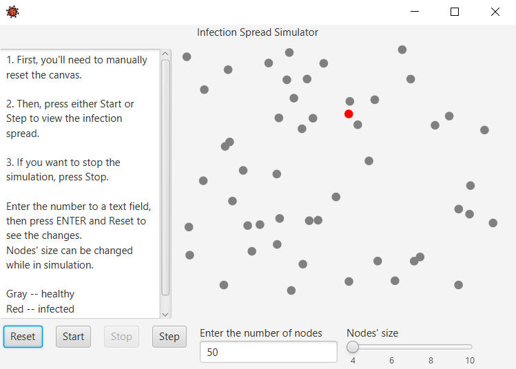
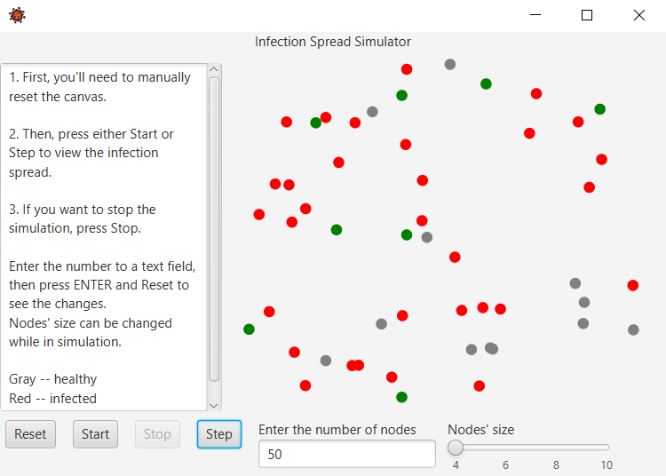
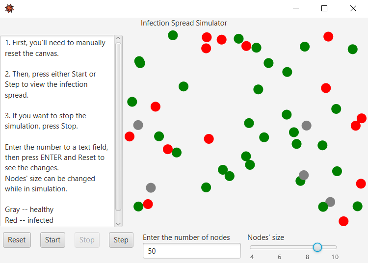
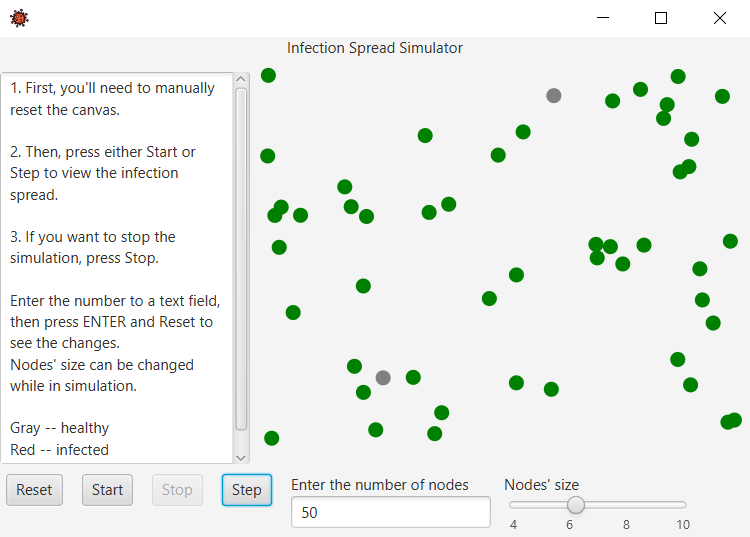

# Virus Spread Simulation
Simple JavaFX application that creates a simulation for virus spreading rates.
People here are represented with colored nodes depending on their health state.  

**Gray** -- healthy  
**Red** -- infected/ill  
**Green** -- immuned/healed

## Usage
1. It is very important to press Reset button first to get simulation started, otherwise the pane will stay empty

  

2. Now you can type preferable number [positive integer, of course] of nodes you want to see on a pane into a small text window. Make sure to press **Enter,** so that the program gets the input. And **Reset!**

  

3. You can use **Start** button to start the simulation, so it'll go by itself.  
Or you can keep better track of the process by manually clicking on **Step** button over and over again.
Notice how every time a healthy node gets too close to an ill one, it also gets infected.    
After some period of time all of the infected nodes will be immuned. That's where you start to see greed nodes being introduced.

  

4. Also, it is possible to change the size of nodes as the simulation goes. It actually helps to scale things up when we are working with comparatively small numbers or to just increase the infection rates as the room and distance between people grows smaller

  

5. And we're done! You can either close the window now or reset the simulation.

## Written in

